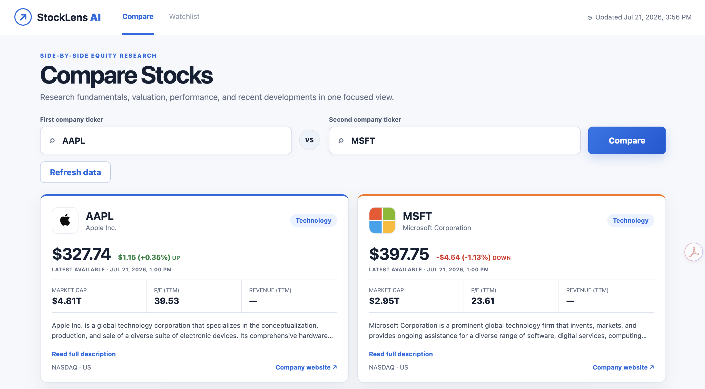
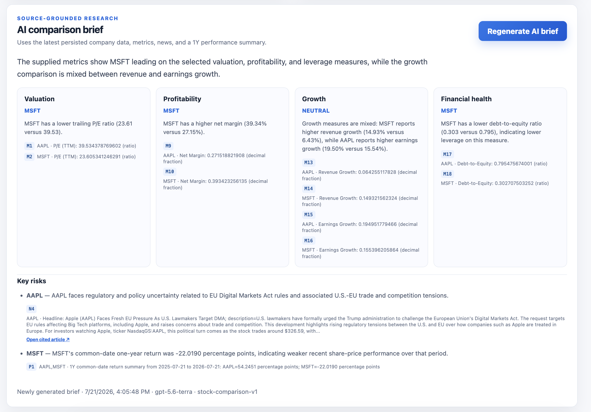
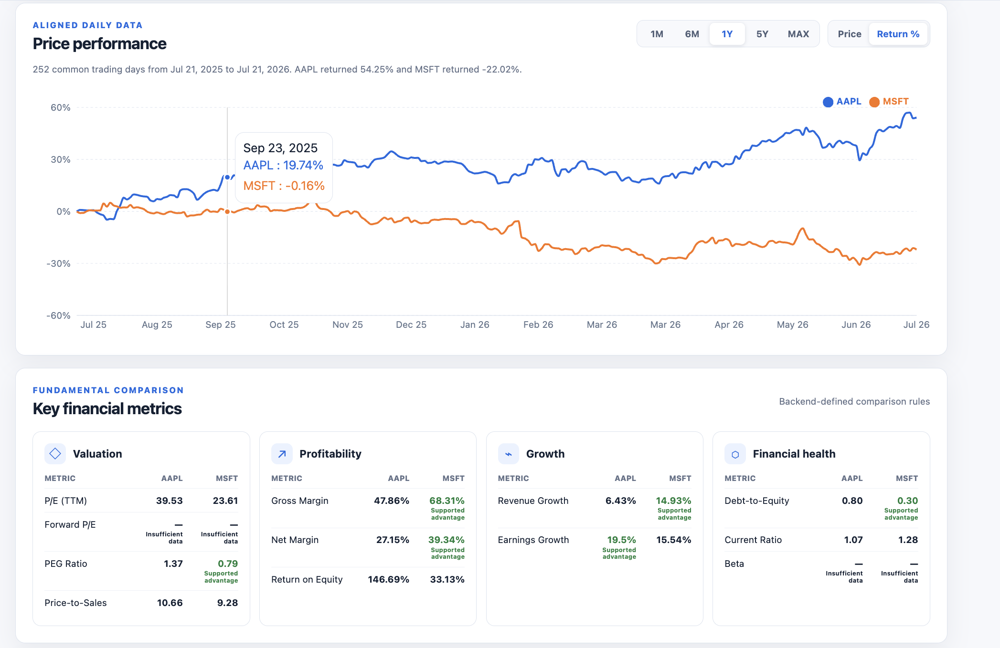
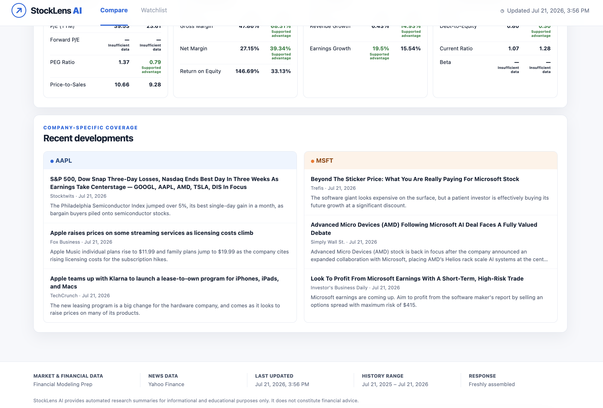
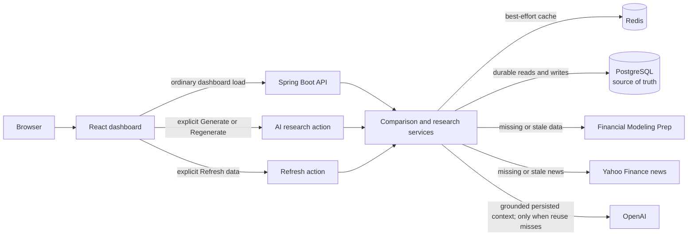

# StockLens AI

StockLens AI compares two public companies in one research dashboard. It combines
persisted company and market data, financial metrics, historical performance,
recent news, and a source-grounded AI brief while keeping PostgreSQL as the
durable source of truth.

StockLens AI is an educational research tool, not financial advice. It does not
recommend trades, predict prices, or provide personalized investment guidance.

## Product Preview






## Key Features

- Side-by-side comparison for two normalized stock symbols
- Raw price and normalized return chart modes across `1M`, `6M`, `1Y`, `5Y`, and
  `MAX`
- Grouped valuation, profitability, growth, and financial-health metrics
- Recent ticker-scoped Yahoo Finance news with deterministic relevance filtering
- Explicitly generated, source-grounded AI comparison briefs with cited claims
- Typed AI output validation, a single repair retry, and a 15-source limit
- Redis cache-aside reads with fresh PostgreSQL fallback
- Visible cached/new response status and data provenance
- Manual provider-data refresh without automatic AI regeneration
- Explicit AI regeneration when a new model response is wanted

## Technology Stack

| Area | Implemented stack |
|---|---|
| Backend | Java 21, Spring Boot 4.1, Spring Data JPA, Spring AI 2.0, Maven |
| Data | PostgreSQL 18, Redis 8, Flyway |
| Frontend | React 19, TypeScript 6, Vite 8, Recharts 3.9, standard CSS |
| Testing | JUnit, Mockito, PostgreSQL/Redis Testcontainers, Vitest 4, React Testing Library 16 |
| Providers | Financial Modeling Prep, unofficial Yahoo Finance news adapter, OpenAI |
| Local tooling | Docker Compose, Maven Wrapper, npm |

Exact dependency versions are recorded in [`backend/pom.xml`](backend/pom.xml),
[`frontend/package.json`](frontend/package.json), and the lockfiles.

## Architecture



OpenAI is not called during ordinary dashboard loading. Redis is optional and
disposable; a Redis outage may reduce performance but does not replace or bypass
the PostgreSQL durability boundary.

See [`docs/architecture.md`](docs/architecture.md) for package boundaries,
failure degradation, cache invalidation, and AI grounding details.

## Data Flow

### Dashboard request

For each feature, the backend reads in this order:

```text
Redis → fresh and usable PostgreSQL → provider only when missing or stale
```

The aggregated comparison is assembled from normalized application DTOs and can
then be cached as a canonical ticker-pair response.

### AI brief request

```text
persisted StockLens data
→ deterministic grounded context and input hash
→ Redis / fresh matching PostgreSQL brief reuse
→ OpenAI only when reuse misses or forceRefresh=true
→ typed validation and at most one repair
→ PostgreSQL persistence and best-effort Redis cache
```

### Manual refresh

```text
invalidate affected caches
→ refresh provider-backed sections
→ persist successful data
→ reload the dashboard
```

The normal dashboard refresh action does not regenerate the AI brief. AI
regeneration remains an explicit, separately costed action.

## Local Development

### Prerequisites

- Java 21
- Node.js 24 and npm (see [`.nvmrc`](.nvmrc))
- Docker Desktop or another Docker Compose-compatible runtime

Maven is provided by the wrapper; no global Maven installation is required.

### 1. Configure local environment

```bash
git clone <your-repository-url>
cd StockLens-AI
cp .env.example .env
```

Add your own `FMP_API_KEY` and `OPENAI_API_KEY` to the untracked `.env` file.
Set `OPENAI_MODEL` to a model available to your API account. Never commit
`.env`; a ChatGPT subscription is not an OpenAI API credential.

### 2. Start PostgreSQL and Redis

```bash
docker compose up -d
docker compose ps
```

The local defaults expose PostgreSQL on `5432` and Redis on `6379`.

### 3. Start the backend

The existing script loads the root `.env` and starts the Maven wrapper:

```bash
./scripts/run-backend.sh
```

Alternatively, export the required variables in your shell and run:

```bash
cd backend
./mvnw spring-boot:run
```

The API listens on `http://localhost:8080`; Actuator health is available at
`/actuator/health`.

### 4. Start the frontend

```bash
cd frontend
npm ci
npm run dev
```

Open the URL printed by Vite, normally `http://localhost:5173`. The development
server proxies `/api` and `/actuator` to port `8080`, so no frontend secret is
required. `VITE_API_BASE_URL` is only needed when building or running against a
different backend origin.

To stop local infrastructure without deleting named volumes:

```bash
docker compose down
```

## Environment Variables

| Variable | Requirement / default | Purpose |
|---|---|---|
| `FMP_API_KEY` | Required for FMP-backed refreshes | Financial Modeling Prep credential |
| `FMP_BASE_URL` | Optional; `https://financialmodelingprep.com/stable` | FMP API root |
| `FMP_CONNECT_TIMEOUT` / `FMP_READ_TIMEOUT` | Optional; `2s` / `5s` | FMP network timeouts |
| `FMP_MAX_ATTEMPTS` | Optional; `2` | Bounded transient FMP attempts |
| `YAHOO_FINANCE_BASE_URL` | Optional; `https://finance.yahoo.com` | Unofficial news adapter root |
| `YAHOO_FINANCE_CONNECT_TIMEOUT` / `YAHOO_FINANCE_READ_TIMEOUT` | Optional; `2s` / `5s` | Yahoo adapter timeouts |
| `YAHOO_FINANCE_MAX_ATTEMPTS` | Optional; `2` | Bounded transient Yahoo attempts |
| `OPENAI_API_KEY` | Required only for new AI generation | OpenAI API credential |
| `OPENAI_MODEL` | Required only for new AI generation | Account-accessible model name |
| `OPENAI_BASE_URL` | Optional; `https://api.openai.com/v1` | OpenAI-compatible API root used by Spring AI |
| `AI_COMPARISON_TEMPERATURE` | Optional; `0.2` | Structured comparison temperature |
| `AI_COMPARISON_MAX_TOKENS` | Optional; `1200` | Structured response token ceiling |
| `POSTGRES_DB` / `POSTGRES_USER` / `POSTGRES_PASSWORD` | Local defaults in `.env.example` | Compose database and backend credentials |
| `SPRING_DATASOURCE_URL` | Optional; local PostgreSQL URL | Backend JDBC connection |
| `SPRING_DATA_REDIS_HOST` | Optional; `localhost` | Redis host; port is currently `6379` |
| `STOCKLENS_CACHE_*_TTL` | Optional; see `.env.example` | Per-category cache freshness durations |
| `VITE_API_BASE_URL` | Optional; empty/same origin | Frontend API origin override; never place secrets here |

Model availability and pricing depend on the OpenAI API account. Provider quotas,
licensing, and field availability likewise depend on the configured provider
accounts.

## API Overview

### Compare two companies

```http
GET /api/v1/comparisons?left=AAPL&right=MSFT&period=1Y&mode=RETURN
```

Returns company summaries, aligned performance, metric groups, recent news,
provenance, cached status, and typed partial-data warnings. Periods are `1M`,
`6M`, `1Y`, `5Y`, and `MAX`; modes are `PRICE` and `RETURN`.

### Generate or reuse a grounded brief

```http
POST /api/v1/comparisons/research
Content-Type: application/json

{"leftTicker":"AAPL","rightTicker":"MSFT","forceRefresh":false}
```

Returns structured advantages, risks, backend-resolved sources, generation
metadata, and `cached`. `forceRefresh: true` bypasses Redis and persisted-brief
reuse and creates a new historical brief row.

### Refresh provider data

```http
POST /api/v1/comparisons/refresh
Content-Type: application/json

{"tickers":["AAPL","MSFT"],"regenerateBrief":false}
```

Returns the normalized tickers and safe partial-refresh warnings. The frontend's
Refresh data action keeps `regenerateBrief` false.

Likely controlled errors include `INVALID_TICKER`, `DUPLICATE_TICKERS`,
`STOCK_NOT_FOUND`, `RATE_LIMITED`, `DATA_UNAVAILABLE`, provider errors,
`AI_PROVIDER_ERROR`, and `INVALID_AI_RESPONSE`. Error bodies include a request ID
without exposing raw provider or infrastructure details.

See [`docs/api.md`](docs/api.md) for concise response shapes and supporting stock
endpoints.

## AI Grounding and Safety

- AI reads persisted StockLens company, market, metric, history, and news data.
- The backend constructs deterministic `C`, `Q`, `M`, `P`, and `N` source IDs.
- The model returns typed structured output and only supplied source IDs.
- IDs are trimmed, blanks removed, deduplicated, and checked against the context.
- Nested claims may use at most 15 unique sources overall.
- One repair retry is allowed; a second invalid result is not persisted or cached.
- Source metadata comes from the backend context, never from model-provided URLs.
- Prompts reject personalized investment advice, guaranteed-return claims, and
  price predictions.

These controls reduce unsupported output but do not guarantee that model
analysis is correct. Users should inspect the cited source data.

## Caching and Freshness

Default TTLs are company `24h`, market `15m`, metrics `6h`, history `6h`, news
`30m`, assembled comparisons `15m`, and AI briefs `1h`. Exactly-at-TTL data is
stale. Successful empty-news retrievals are recorded distinctly from provider
failures, and Redis failures fall through to durable PostgreSQL reads.

See [`docs/architecture.md`](docs/architecture.md#caching-and-freshness) for
history completeness, brief reuse, refresh invalidation, and failure behavior.

## Testing

Backend verification uses mocked provider clients, a fake AI client, and real
PostgreSQL/Redis Testcontainers. Run it with external credentials removed:

```bash
cd backend
env -u FMP_API_KEY -u OPENAI_API_KEY ./mvnw clean verify
```

Frontend tests mock Fetch and require no running backend:

```bash
cd frontend
npm run lint
npm run typecheck
npm test
npm run build
```

Automated tests do not call paid or live providers.

## Three-Minute Demo

1. Compare `AAPL` and `MSFT`.
2. Switch between `PRICE` and `RETURN` and change the period.
3. Inspect backend-defined metric outcomes and missing-value handling.
4. Review recent developments and their original links.
5. Generate the grounded AI brief and open cited news sources.
6. Generate again to demonstrate cached/persisted reuse.
7. Refresh provider data and show that AI does not regenerate automatically.

The complete script and screenshot checklist are in
[`docs/demo.md`](docs/demo.md).

## Known Limitations

- FMP quotas, fields, delays, and display rights depend on the account plan.
- Yahoo Finance news uses an unofficial replaceable adapter and is not a
  guaranteed licensed production contract.
- Quotes are latest-available/delayed data, not exchange-grade real-time data.
- OpenAI model access, latency, and cost depend on the API account.
- There is no authentication, scheduled refresh, or production deployment.
- Exchange and ticker support is constrained by validation and provider coverage.
- The Recharts dependency adds a comparatively large chart chunk, reviewed in
  the production build rather than hidden by raising Vite's warning threshold.
- Runtime OpenAPI/Swagger UI is not currently installed; the implemented public
  contract is documented in [`docs/api.md`](docs/api.md).
- The project is for educational and portfolio demonstration use only.

## Repository Guide

- [`docs/design.md`](docs/design.md) — approved product and system design
- [`docs/architecture.md`](docs/architecture.md) — implemented boundaries and flows
- [`docs/api.md`](docs/api.md) — public REST contracts
- [`docs/demo.md`](docs/demo.md) — concise interview demo
- [`.agent/plans/`](.agent/plans/) — milestone execution records
