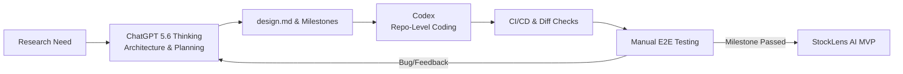
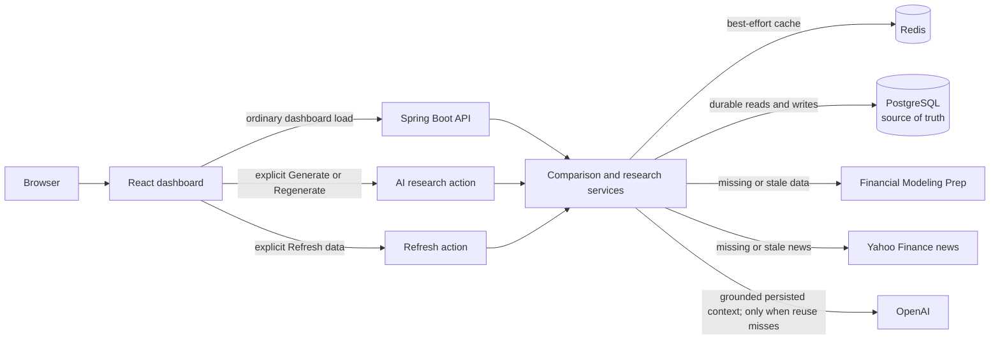

# StockLens AI

StockLens AI is an interactive dashboard that compares two public companies side-by-side across financial metrics, historical performance, recent news, and grounded AI briefs.

The working full-stack MVP was completed in four days through a human-in-the-loop
workflow with **ChatGPT 5.6 Thinking as the product partner** and **Codex as the
engineering partner**.

> **Disclaimer:** StockLens AI is an educational research tool, not financial advice.

Demo: **[Live Demo Video](https://youtu.be/WwVhe4eyfLs)**

## Product Preview


## Built in 4 Days: Human + AI Collaboration

Instead of relying on a single "magic prompt" to build everything at once, I used an **iterative, milestone-driven workflow** to complete this full-stack MVP in 4 days. 

I maintained full control over product direction and architecture, while leveraging **ChatGPT 5.6 Thinking** for high-level technical planning and **Codex** for ground-level implementation.



### ChatGPT 5.6 Thinking — Product Partner

ChatGPT acted as the product and technical planning partner. It helped me:

- I used ChatGPT as a sounding board to brainstorm, scope down, and troubleshoot:

- Scoping the MVP: Trimmed down feature creep to focus strictly on 2-stock comparison and grounded AI briefs.

- Architecture Trade-offs: Evaluated Redis cache-aside strategies, Postgres fallbacks, and multi-provider rate limits.

- Milestone Planning: Translated technical requirements into concise, repo-scoped prompts for Codex with strict acceptance criteria.

- Debugging: Analyzed server logs and edge-case failures to produce tight, repeatable bug-fix tasks.

### Codex — Engineering Partner

Codex handled repository-wide scaffolding, boilerplate, and test coverage:

- Context-Aware Execution: Read existing architecture docs (docs/design.md) before modifying code across Spring Boot and React.

- Automated Validation: Ran Maven, Vitest, linting, and build steps automatically after every milestone change.

- Incremental Fixes: Applied targeted patches whenever manual E2E testing uncovered live integration edge cases.

### Human-in-the-Loop Edge

AI generated code, but I made every core call. I ran the real application locally, challenged invalid LLM citations, tested edge cases, picked third-party API providers, and decided when a milestone was ready to ship.


## Key Features

- Side-by-Side Comparison: Normalized stock ticker metrics across 1M, 6M, 1Y, 5Y, and MAX modes.

- Source-Grounded AI Briefs: Structured comparisons generated via OpenAI API with strict citation validation (up to 15 verified sources max).

- Cache-Aside Architecture: Redis caching with automatic PostgreSQL fallback to minimize API costs and latencies.

- Explicit Triggers: Standard dashboard loads never trigger paid LLM calls; AI brief generation is strictly user-initiated.

- Ticker-Scoped News: Deterministic filtering for Yahoo Finance news items.

## Technology Stack

| Area | Implemented stack |
|---|---|
| Backend | Java 21, Spring Boot 4.1, Spring Data JPA, Spring AI 2.0, Maven |
| Data | PostgreSQL 18, Redis 8, Flyway |
| Frontend | React 19, TypeScript 6, Vite 8, Recharts 3.9, standard CSS |
| Testing | JUnit, Mockito, PostgreSQL/Redis Testcontainers, Vitest 4, React Testing Library 16 |
| Providers | Financial Modeling Prep, unofficial Yahoo Finance news adapter, OpenAI |
| Local tooling | Docker Compose, Maven Wrapper, npm |

Exact dependency versions are recorded in [`backend/pom.xml`](backend/pom.xml),
[`frontend/package.json`](frontend/package.json), and the lockfiles.

## Architecture



OpenAI is not called during ordinary dashboard loading. Redis is optional and
disposable; a Redis outage may reduce performance but does not replace or bypass
the PostgreSQL durability boundary.

See [`docs/architecture.md`](docs/architecture.md) for package boundaries,
failure degradation, cache invalidation, and AI grounding details.


For each feature, the backend reads in this order:
- Dashboard Load: Reads Redis $\rightarrow$ fresh PostgreSQL $\rightarrow$ External Providers (FMP/Yahoo) only when missing or stale.
- AI Brief Request: Pulls persisted stock context $\rightarrow$ Generates grounded brief via OpenAI $\rightarrow$ Validates structured response $\rightarrow$ Persists to DB & Redis.
- Manual Refresh: Invalidates caches $\rightarrow$ Fetches fresh provider metrics $\rightarrow$ Reloads dashboard without re-running LLM calls.


## Local Development

### Prerequisites

- Java 21
- Node.js 24 and npm (see [`.nvmrc`](.nvmrc))
- Docker Desktop or another Docker Compose-compatible runtime

Maven is provided by the wrapper; no global Maven installation is required.

### 1. Configure local environment

```bash
git clone <your-repository-url>
cd StockLens-AI
cp .env.example .env
```

Add your FMP_API_KEY and OPENAI_API_KEY to the .env file.

### 2. Start PostgreSQL and Redis

```bash
docker compose up -d
docker compose ps
```

The local defaults expose PostgreSQL on `5432` and Redis on `6379`.

### 3. Start the backend

The existing script loads the root `.env` and starts the Maven wrapper:

```bash
./scripts/run-backend.sh
```

### 4. Start the frontend

```bash
cd frontend
npm ci
npm run dev
```

Open `http://localhost:5173` in your browser.


## Documentation Guide

- [`docs/design.md`](docs/design.md) — approved product and system design
- [`docs/architecture.md`](docs/architecture.md) — implemented boundaries and flows
- [`docs/api.md`](docs/api.md) — public REST contracts
- [`.agent/plans/`](.agent/plans/) — milestone execution records
