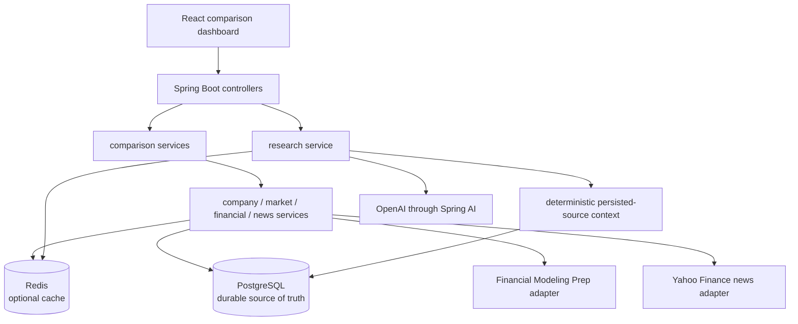

# Implemented Architecture

StockLens AI is a modular monolith: one Spring Boot application owns HTTP,
business orchestration, persistence, caching, and provider adapters, while one
React application renders the comparison workflow.

## Runtime Boundaries



Provider DTOs remain inside their adapters. Controllers expose application DTOs,
not provider responses or JPA entities. Business logic lives in services, and
Flyway owns all schema changes while Hibernate runs with `ddl-auto=validate`.

## Backend Packages

| Package | Responsibility |
|---|---|
| `common` | validation, cache facade/keys, time policy, request IDs, safe errors |
| `company` | normalized company identity and combined stock overview reads |
| `market` | FMP boundary, market snapshots, provider normalization |
| `financial` | metrics, historical prices, periods, returns, metric definitions |
| `news` | Yahoo boundary, relevance filtering, canonical URLs, persistence |
| `comparison` | aggregated dashboard, alignment, metric outcomes, refresh |
| `research` | persisted source loading, grounding, AI validation, brief persistence |

## Durable-First Feature Reads

Company profile, market snapshot, metrics, history, and news follow the same
cache-aside principle:

```text
Redis hit
  └─ miss/failure → fresh usable PostgreSQL
                    └─ missing/stale/unusable → external provider
                                              → validate and persist
                                              → best-effort cache write
```

Redis stores serialized public/application records, never JPA entities or raw
provider objects. Cache read/write failures are sanitized and do not prevent the
business result from being returned.

Historical series are usable only when they contain at least two distinct dates
with positive return values. Bounded periods require the first and last points
to fall within seven calendar days of the requested boundaries; `MAX` requires
two usable dates without a bounded-start rule. The oldest selected retrieval
timestamp controls freshness.

News distinguishes three states:

- no successful retrieval marker;
- a successful retrieval with zero results;
- provider failure, which creates no success marker and does not erase articles.

## Caching and Freshness

| Category | Default TTL |
|---|---:|
| Company profile | 24 hours |
| Market snapshot | 15 minutes |
| Financial metrics | 6 hours |
| Historical prices | 6 hours |
| Recent news | 30 minutes |
| Comparison response | 15 minutes |
| AI brief | 1 hour |

Exactly-at-expiry is stale. Future timestamps are accepted with sanitized
warning logs. Complete comparison responses use canonical ticker-pair keys, then
are reoriented to the requested left/right order on cache hits.

Manual refresh evicts feature keys for the requested tickers plus comparison and
brief namespaces, refreshes company/market/metrics/news, and returns safe partial
warnings. History is invalidated and reloaded through its normal flow. AI is
regenerated only when `regenerateBrief=true`; the dashboard uses false.

## Grounded AI Flow

```text
PostgreSQL source rows
→ ordered C/Q/M/P/N source records
→ bounded deterministic context
→ canonical input hash
→ Redis brief lookup
→ newest matching fresh PostgreSQL brief lookup
→ OpenAI generation only on miss or forceRefresh
→ typed validation
→ one repair retry when invalid
→ persist brief and source links
→ best-effort Redis write
```

The newest persisted brief lookup matches canonical company IDs, input hash,
prompt version, and model, ordered by generation time then ID. Reconstructed
briefs are checked against current grounded source metadata. Corrupt persisted
data is skipped and normal generation continues.

The AI validator enforces required categories, allowed winners, bounded text and
risk counts, known normalized source IDs, at most 15 unique cited sources, and
prohibited-advice language. Invalid repaired output is never persisted or cached.

## Failure Degradation

- Redis unavailable: continue through PostgreSQL/provider paths.
- Provider section unavailable: return controlled errors or typed comparison
  warnings while preserving successful sections.
- Refresh partially fails: retain persisted dashboard data and return warnings.
- AI unavailable or invalid: preserve the dashboard and any prior frontend brief;
  return a controlled section error.
- Unknown source reference during rendering: show an unavailable-source label,
  never an untrusted model URL.

PostgreSQL remains the only durable source of truth throughout these paths.

